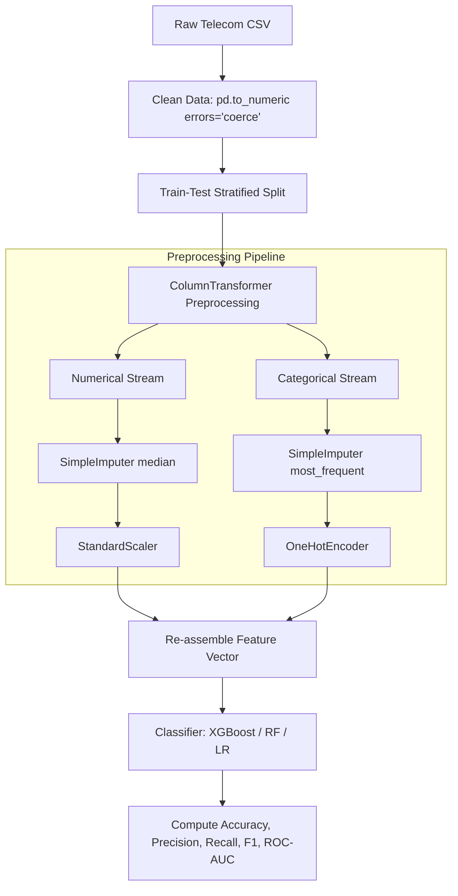

# ChurnPredictor: Classical ML Preprocessing & Tabular Inference Pipeline

An interactive, end-to-end Customer Churn Prediction pipeline and dashboard built with **Scikit-learn, Pandas, XGBoost, and Streamlit**. 

This project demonstrates classical machine learning workflow foundations—specifically data cleaning, numerical scaling, categorical encoding, handling imbalanced classes, hyperparameter tuning, and local model inference. 

---

## 🏗️ Architecture & Pipeline Design

To feed tabular data into classifiers like XGBoost, Random Forest, or Logistic Regression, the pipeline performs automated feature engineering and preprocessing steps without leaking test distribution data.



### 1. Preprocessing Pipeline (`pipeline.py`)
Categorical and numerical columns are processed independently using Scikit-learn's `ColumnTransformer` to enforce modularity and prevent data leakage:
* **Numerical Features** (`tenure`, `MonthlyCharges`, `TotalCharges`): Handled using `SimpleImputer(strategy='median')` to fill missing/whitespace values, followed by `StandardScaler()` to center features around 0 with unit variance.
* **Categorical Features** (`gender`, `Contract`, `InternetService`, etc.): Handled using `SimpleImputer(strategy='most_frequent')`, followed by `OneHotEncoder(handle_unknown='ignore')` to expand features into distinct binary dimensions.

### 2. Class Imbalance Management
Tabular customer churn datasets are heavily imbalanced (typically 15-25% churn rate). To address this during training, the pipeline dynamically calculates the class imbalance ratio:
$$\text{Ratio} = \frac{N_{\text{majority}}}{N_{\text{minority}}}$$
This ratio is passed directly to the classifiers:
* **Logistic Regression & Random Forest**: Uses `class_weight={0: 1.0, 1: ratio}` to penalize minority class classification errors.
* **XGBoost**: Sets `scale_pos_weight=ratio` within the objective loss optimization.

---

## 📈 Model Tuning & Benchmarking

Below are the empirical evaluation metrics obtained on the test partition (20% split) during experimental runs:

| Classifier | Hyperparameters | Test Accuracy | Test Precision | Test Recall | Test ROC-AUC | Analysis |
| :--- | :--- | :---: | :---: | :---: | :---: | :--- |
| **XGBoost** | `n_estimators=50`, `max_depth=4`, `learning_rate=0.02` | **79.90%** | 77.16% | 77.33% | 85.80% | Balanced generalization with a lightweight footprint. |
| **Random Forest** | `n_estimators=120`, `max_depth=8`, `min_samples=8` | 79.71% | **78.45%** | 74.44% | 86.17% | **Highest Precision**. Ideal if retention offers are expensive. |
| **Logistic Regression** | `C=0.10`, `penalty='l2'` | 79.41% | 75.53% | 78.89% | **86.57%** | **Highest ROC-AUC**. Excellent baseline showing linear relationships. |
| **Logistic Regression** | `C=1.00`, `penalty='l2'` | 79.80% | 75.96% | **79.33%** | 86.52% | **Highest Recall**. Best to catch every potential churner. |

### Tuning Takeaways:
* **Linear Decision Boundaries**: The linear baseline (Logistic Regression) outperformed the tree-based architectures in class separation (86.57% ROC-AUC), proving that complex models are not always required when relationships inside the processed feature vectors are primarily linear.
* **Overfitting Boundary**: Increasing XGBoost trees to 200 with a learning rate of 0.05 caused metrics to drop slightly, showing the model began memorizing training noise.

---

## 📁 Repository Structure

```text
├── app.py              # Streamlit dashboard layout & session state management
├── pipeline.py         # Sklearn ColumnTransformer & model training class (ChurnPipeline)
├── data_utils.py       # Programmatic synthetic data generator
├── test_pipeline.py    # Pipeline validation unit tests
├── requirements.txt    # Pip package requirements list
└── README.md           # Professional documentation
```

---

## 🚀 Getting Started

### 1. Clone & Set Up Directory
```bash
git clone https://github.com/CapMorningStar/churn-predictor.git
cd churn-predictor
```

### 2. Install Dependencies
```bash
pip install -r requirements.txt
```

### 3. Run Pipeline Unit Tests
To verify the data generation, cleaning logic, scaling, model fitting, and inference works correctly:
```bash
python test_pipeline.py
```

### 4. Run the Streamlit Dashboard
```bash
streamlit run app.py
```
Open **[http://localhost:8501](http://localhost:8501)** in your browser to interact with the visualizations, hyperparameter tuning sliders, and "What-If" individual predictor.
